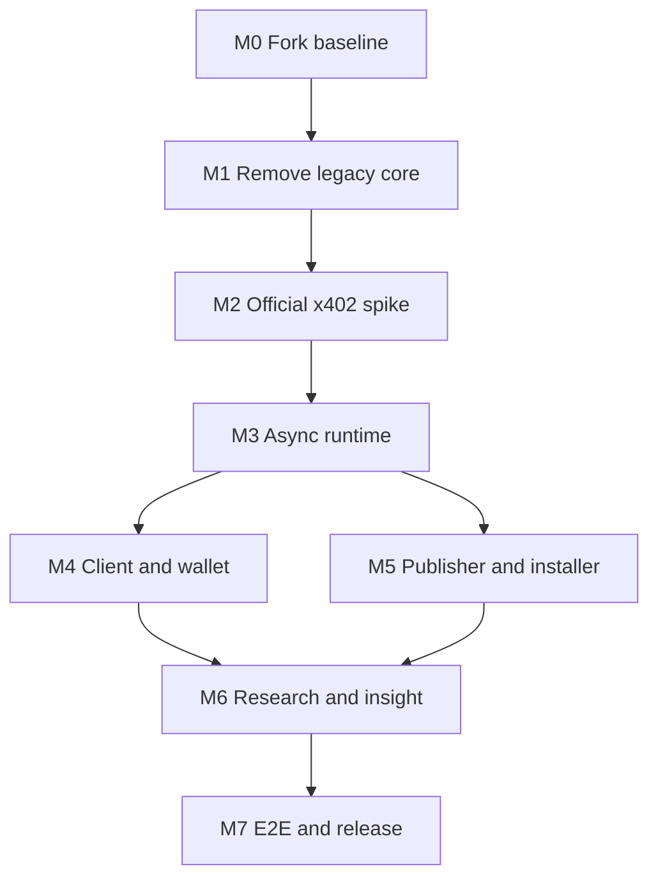

# AgentPayKit PayBot Adaptation — Implementation Plan Index

> **For agentic workers:** REQUIRED SUB-SKILL: Use superpowers:subagent-driven-development (recommended) or superpowers:executing-plans to implement this plan task-by-task. Steps use checkbox (`- [ ]`) syntax for tracking.

**Goal:** 将 `superposition/paybot@1d6d3f4ac33e2a338e068cdfb80a67f63544a8e1` 原仓改造成可供 Codex 与 Claude Code 使用的 AgentPayKit MVP。

**Architecture:** 保留 PayBot 的 monorepo 与钱包 UI 骨架，删除自定义 QUSD/Escrow/Facilitator 支付链路；以官方 x402 v2、Cloudflare Workers/Hono、D1/Queue/R2、共享 macOS Client 和本地 MetaMask Bridge 组成新主链路。

**Tech Stack:** Node.js 22 LTS、pnpm、Turborepo、TypeScript strict、Vitest、Hono、Cloudflare Workers、D1、Queues、R2、viem/wagmi、React、SQLite、官方 `@x402/*` 2.19.0。

## Global Constraints

- 术语和行为以已批准的改造设计与 PRD 为准；本计划不修改产品范围。
- 保留 PayBot MIT License、版权声明、Git 历史与固定上游 SHA。
- 金额在协议边界使用十进制字符串，在计算边界使用 `bigint`；禁止 JavaScript `number` 表示 USDC 原子金额。
- 生产路径不得包含 QUSD、Escrow、Hardhat、自建 Facilitator、私钥托管或自动钱包签名。
- Execution Endpoint 必须 `verify → enqueue → 202`；Queue 内部 `execute → Success Policy → settle → deliver`。
- Base Sepolia 与 Base Mainnet 使用不同 Release ID；每次 Invocation 由 MetaMask 明确签名。
- 每个任务遵循 RED → GREEN → REFACTOR，完成后按指定边界提交；不得跨里程碑偷跑。

---

## Dependency Map



## Plan Set

| Order | File                                   | Deliverable                          | Gate                          |
| ----: | -------------------------------------- | ------------------------------------ | ----------------------------- |
|     0 | `01-m0-fork-baseline.md`               | Provenance、pnpm/Node 基线、CI       | 原 PayBot 在新工具链可构建    |
|     1 | `02-m1-prune-legacy-paybot.md`         | 删除旧支付核心并保留 UI 骨架         | 生产依赖无旧合约/Facilitator  |
|     2 | `03-m2-official-x402-workers-spike.md` | 官方 x402 + Workers 同步兼容 Spike   | Sepolia verify/settle 成功    |
|     3 | `04-m3-async-runtime-settlement.md`    | 协议、D1/Queue/R2、延迟结算          | 失败零收费；成功后收费        |
|     4 | `05-m4-client-browser-bridge.md`       | Client、预算、CLI、MetaMask Bridge   | macOS 单次授权闭环            |
|     5 | `06-m5-publisher-release-installer.md` | 发布、签名、打包、双 Agent 安装      | 一条命令启用两个 Agent        |
|     6 | `07-m6-deep-research-observability.md` | Deep Research Lite、日志、PayInsight | 0.01 USDC 示例通过 Policy     |
|     7 | `08-m7-e2e-mainnet-release.md`         | 12 场景、安全、主网与外部验收        | PRD Definition of Done 全通过 |

## Target Repository Boundary

```text
apps/runtime
packages/{protocol,payment,runtime,client,browser-bridge,cli,publisher,installer,observability,testkit}
examples/paid-deep-research-lite
tests/{contract,integration,e2e,security}
docs/{architecture,runbooks,acceptance,upstream}
```

## Global Verification

在每个里程碑结束时运行：

```bash
pnpm install --frozen-lockfile
pnpm format:check
pnpm lint
pnpm typecheck
pnpm test
pnpm build
```

预期：六条命令退出码均为 `0`；任何真实 Sepolia/Mainnet 测试必须由显式环境变量开启，默认 CI 不花费资金。

## Completion Protocol

- [ ] 对照本索引确认上游里程碑已合并且 Gate 有证据。
- [ ] 执行对应计划的全部复选框，不跳过失败测试步骤。
- [ ] 将测试输出、交易哈希、脱敏日志或安装记录写入该里程碑指定的 evidence 路径。
- [ ] 运行 Global Verification，并确认 `git status --short` 只含本里程碑预期文件。
- [ ] 请求代码审查；修复后再进入下一里程碑。
