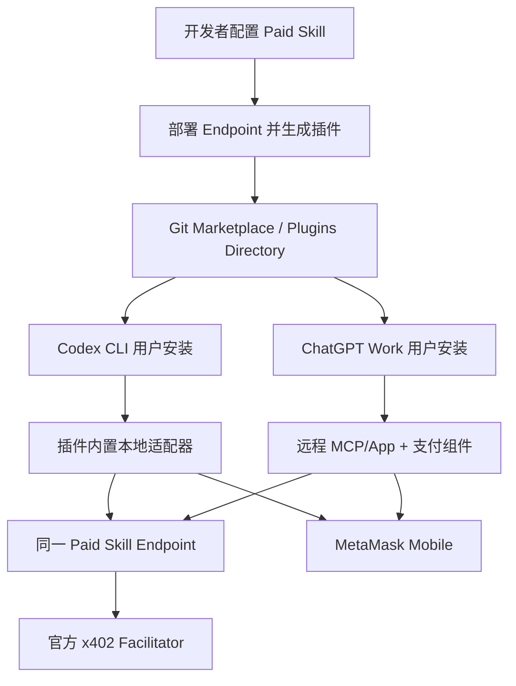
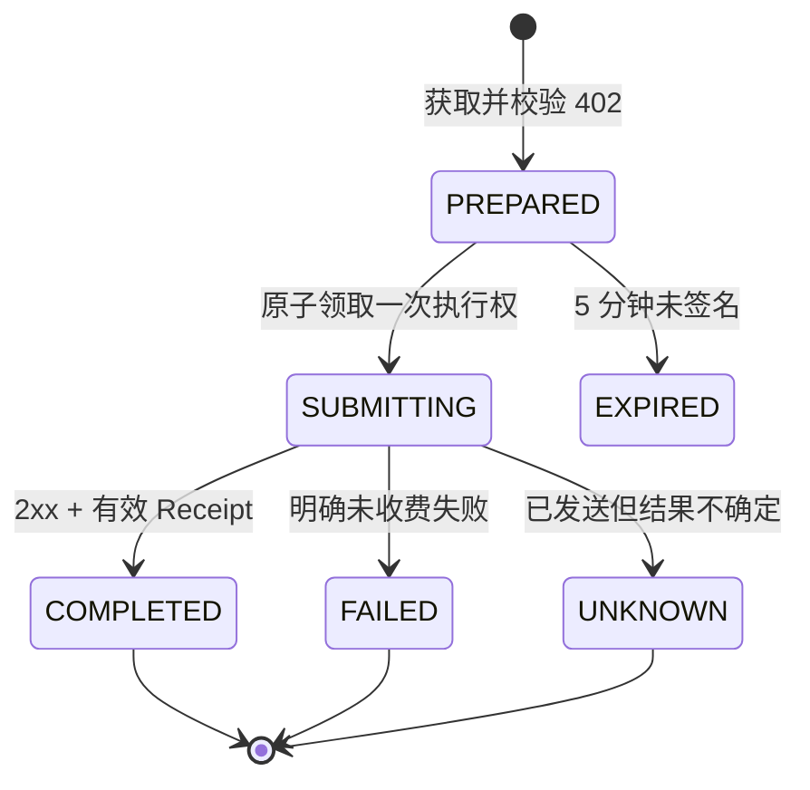

# AgentPayKit B 方案：真实 Agent 付费 Skill 闭环开发计划

> **执行方式：** 本计划只定义开发与验收步骤，不包含实现代码。建议在本地新建功能分支，按 Task 0 → Task 14 顺序执行；每个 Task 都先写失败测试、再实现、复测并单独提交。

**目标：** 在不破坏现有同步 x402 支付核心的前提下，实现“开发者发布付费 Skill → 用户一次安装插件 → Codex CLI 或网页版 ChatGPT Work 自动识别并调用 → 用户在 MetaMask 中逐笔确认 → 成功后结算并返回结果与 Receipt”的真实闭环。

**首个真实网络：** Base Sepolia（链 ID `84532`）

**首个验收价格：** `0.01 USDC`

**现有基线：** 当前 `main` 已具备 Next.js/Vercel 付费 Endpoint、官方 x402 v2、固定 USDC 报价、MetaMask Mobile、CLI 两请求支付链路、成功后结算和三类稳定错误；尚不具备标准插件发布、Codex 原生安装以及网页版 Work 支付组件。

---

## 1. 已确认的产品决定

### 1.1 B 方案不是“网页远程调用本地 CLI”

两种 Agent 表面共享协议核心，但运行适配器不同：

| Agent 环境          | 安装内容                                                  | 支付适配器                  | 钱包交互                                            |
| ------------------- | --------------------------------------------------------- | --------------------------- | --------------------------------------------------- |
| Codex CLI           | Paid Skill 插件、标准 `SKILL.md`、插件内置本地 MCP/运行时 | 本机 Node.js 进程           | 终端显示二维码，MetaMask Mobile 逐笔确认            |
| ChatGPT Work 网页版 | 同一插件中的 Skill + `.app.json`                          | 远程 MCP/App + 内嵌支付组件 | 组件显示报价与二维码/深链，MetaMask Mobile 逐笔确认 |

网页版 Work 不依赖用户电脑上的 `agentpay`、本地端口或浏览器扩展。

### 1.2 一次安装的定义

用户安装某个 Paid Skill 插件后，不再单独安装 `@agentpaykit/cli`。插件必须同时携带：

- 标准 Skill 指令和触发描述；
- 不可变的 Paid Skill 描述文件及指纹；
- Codex CLI 可调用的本地运行适配器；
- 网页版 Work 使用的 AgentPayKit App 映射；
- 插件展示信息和必要资产。

`.app.json` 引用由 AgentPayKit 维护的同一个 Work App ID，不要求每位 Paid Skill 开发者分别创建 ChatGPT App。开发期使用明确的开发 App ID；进入公开发布前替换为已审核的正式 App ID。脚手架在没有有效 App ID 时必须拒绝生成“可用于 Work”的正式插件，不能留下占位值。

### 1.3 继续保留的 MVP 边界

- 只支持 30–60 秒内完成的同步 Skill；当前服务端业务上限继续为 45 秒。
- 只支持官方 x402 v2 `exact` 固定价 USDC。
- 每次付费都必须在 MetaMask 中重新签名；不做自动支付、免确认预算或托管钱包。
- 私钥、助记词和 Secret Recovery Phrase 永不进入 AgentPayKit、插件、MCP、日志或测试夹具。
- `PAYMENT_STATE_UNKNOWN` 不自动重试。
- Base Sepolia 全部通过前，不做 Mainnet 付款，也不声称已经完成公开发布。
- 不恢复已经删除的 Runtime、Queue、Browser Bridge 或异步结算架构。

### 1.4 本阶段新增但严格受限的服务能力

B 方案需要新增一个远程 AgentPayKit Work App。它只负责：

- 校验已发布 Skill 描述和真实 402 报价；
- 为支付组件创建短期调用会话；
- 接收组件提交的 EIP-712 支付签名；
- 发送一次已签名请求；
- 校验业务结果和 `PAYMENT-RESPONSE`；
- 向组件和模型返回脱敏结果。

它不是 Skill 执行托管平台、通用 Registry、钱包托管服务或支付代理账户。

### 1.5 Work 端必须诚实保留的信任边界

当前公开机制没有向通用 MCP tool 提供“这次调用来自哪个已安装 Skill 文件”的可验证证明。因此 Work App 可以验证描述文件、指纹、真实 402 报价和支付字段彼此一致，但不能仅凭模型传入的 `skillRef` 密码学证明它一定来自用户刚安装的那份插件。

MVP 的防线是：只接受规范 HTTPS 描述、严格 SSRF 防护、指纹一致性、插件内固定 maxPrice，以及在签名前由组件展示真实 Skill 名称、Endpoint Origin、金额、网络和 payTo，让用户做最终核对。计划不得宣称已经实现“宿主绑定的插件身份”。如果将来 OpenAI 提供可验证的插件调用身份，或产品增加受信发布目录，再单独升级这一边界。

---

## 2. 目标架构



### 2.1 共享核心

从现有 `packages/cli` 中提取与平台无关的支付协议核心，供 CLI 插件运行时和 Work App 共同使用：

- 输入大小和 Endpoint 校验；
- 第一次请求与 402 Challenge 解析；
- network、asset、amount、payTo、resource 和 maxPrice 校验；
- EIP-712 签名材料生成；
- 已签名请求的单次发送；
- Receipt 校验；
- `not-charged`、`charged`、`unknown` 状态映射；
- Challenge、Signature 和错误信息脱敏。

钱包连接、二维码渲染、MCP 传输和 Work UI 不进入共享核心。

### 2.2 Work 端数据隔离

| 数据                                                    | 可进入 `structuredContent` / `content` | 只能进入组件 `_meta` 或组件到服务端的 HTTPS 请求 |
| ------------------------------------------------------- | -------------------------------------- | ------------------------------------------------ |
| Skill 名称、描述、价格、网络、收款地址、Endpoint Origin | 是                                     | 否                                               |
| 业务输入摘要                                            | 是，仅脱敏摘要                         | 原始输入按业务需要传给服务端                     |
| 完整 `PAYMENT-REQUIRED` Challenge                       | 否                                     | 是                                               |
| MetaMask 连接 URI                                       | 否                                     | 是                                               |
| 完整 EIP-712 Signature / `PAYMENT-SIGNATURE`            | 否                                     | 是                                               |
| 交易哈希、金额、网络、payTo                             | 是                                     | 否                                               |
| 服务端会话 capability token                             | 否                                     | 是                                               |

Work 组件不得把 Signature 作为 MCP 工具参数发送，因为工具输入可能进入宿主记录。组件应通过 CSP 白名单内的同源 HTTPS 执行接口直接提交。

### 2.3 Work 端会话状态机



同一个 invocation 只能从 `PREPARED` 原子地进入一次 `SUBMITTING`。任何第二次提交都返回稳定的重复调用错误，不再次访问 Paid Skill Endpoint。

---

## 3. 计划中的仓库结构

以下路径是实施目标；Task 0 的兼容性 Spike 通过后再最终锁定命名。

```text
packages/
  client-core/                         # 平台无关的 x402 消费核心
  cli/                                 # 保留命令行入口与 MetaMask 终端适配
  plugin-runtime/                      # 可打包进插件的本地 MCP 运行时
  server/                              # Paid Skill 服务端与描述文件生成
  create-agentpay-skill/               # 生成 Endpoint、插件和 Marketplace
apps/
  work-pay/
    src/mcp/                            # 远程 MCP tools/resources
    src/invocations/                    # 会话状态机与存储接口
    src/security/                       # SSRF、日志脱敏、限流
    app/api/invocations/[id]/execute/   # 组件直连签名提交接口
    widget/                             # Apps SDK/MCP Apps 支付组件
plugins/
  agentpaykit-dev/                      # 仓库内开发测试插件
.agents/plugins/marketplace.json        # 仓库级测试 Marketplace
tests/
  agent/codex-cli/                      # 干净 CODEX_HOME 安装与触发测试
  agent/work-app/                       # MCP、组件与会话集成测试
  live/base-sepolia/                    # 只由人工显式启用的真实链 Gate
```

脚手架生成的单个 Paid Skill 项目应新增：

```text
plugin/
  .codex-plugin/plugin.json
  .app.json
  .mcp.json
  config/paid-skill.json
  skills/<skill-name>/SKILL.md
  skills/<skill-name>/agents/openai.yaml
  runtime/agentpay-mcp.mjs
  assets/
.agents/plugins/marketplace.json
skill/paid-skill.json
skill/SKILL.md
```

---

## 4. 核心接口契约

以下是计划必须固定的接口语义，不要求使用相同内部实现。

| 契约                                | 输入                                                                                    | 输出/约束                                               |
| ----------------------------------- | --------------------------------------------------------------------------------------- | ------------------------------------------------------- |
| `preparePaidCall`                   | endpoint、input、maxPrice、timeout                                                      | 未签名调用计划；包含校验后的 requirement 和人类可读摘要 |
| `createPaymentPayload`              | requirement、payer                                                                      | MetaMask 需要签署的 EIP-712 数据；不写日志              |
| `executePreparedCall`               | prepared call、signature、payer                                                         | 最多发送一次已签名请求，返回 `CallResult` 或稳定错误    |
| `PaidSkillDescriptor`               | skillId、version、name、description、endpoint、price、network、payTo、input schema 摘要 | 规范 JSON、SHA-256 指纹、HTTPS 同源约束                 |
| `InvocationStore`                   | create、claim、complete、fail、markUnknown、get                                         | `claim` 必须原子化；默认 TTL 5 分钟，结果 TTL 10 分钟   |
| Work `prepare_paid_skill_call` tool | immutable skillRef、input                                                               | 模型可见报价摘要 + 组件专用隐藏 Challenge/capability    |
| Work 执行接口                       | capability、payer、signature                                                            | 只接受一次；返回脱敏状态、结果和 Receipt                |
| Work `get_paid_skill_result` tool   | invocationId                                                                            | 只返回可进入模型上下文的最终结果和 Receipt              |

所有错误继续使用现有稳定码，新增错误不得覆盖原语义：

- `PAYMENT_REJECTED`：用户拒绝，零转账。
- `SKILL_EXECUTION_FAILED`：兼容服务明确业务失败，预期零转账。
- `PAYMENT_STATE_UNKNOWN`：签名请求已发送，但收费状态不确定；停止且不重试。
- 可新增 `PLUGIN_CONFIG_INVALID`、`SKILL_DESCRIPTOR_MISMATCH`、`INVOCATION_EXPIRED`、`INVOCATION_ALREADY_SUBMITTED` 和 `WORK_APP_UNAVAILABLE`。

---

## 5. 实施任务

### Task 0：先验证两个平台假设，形成阻塞 Gate

**目的：** 在大规模改造前验证 Codex 插件和 Work Apps SDK 的真实运行方式。

**只创建实验文件：** `spikes/plugin-runtime/`、`spikes/work-widget/`、`docs/evidence/agent-surface-spike.md`。

- [ ] 安装当前稳定 Codex CLI，在独立临时 `CODEX_HOME` 中建立最小 Git Marketplace。
- [ ] 验证 `codex plugin marketplace add <owner/repo>` 和 `codex plugin add <plugin>@<marketplace>` 能安装插件。
- [ ] 验证 `.mcp.json` 中相对插件根目录的预构建 Node 入口能启动；记录实际 cwd、路径解析规则和 Windows/macOS/Linux 差异。
- [ ] 验证插件安装过程不执行 npm lifecycle scripts，因此正式方案必须携带已经打包好的单文件运行时。
- [ ] 在 ChatGPT Developer mode 创建最小远程 MCP App，验证组件能收到工具结果 `_meta`，而模型和聊天记录看不到 `_meta`。
- [ ] 验证组件能通过 `connectDomains` 调用同源 HTTPS 接口、通过 MCP Apps bridge 更新模型上下文。
- [ ] 用 MetaMask 测试账户验证 SDK 在 Work iframe CSP 中可以产生二维码/深链并发起 `eth_signTypedData_v4`；只签本地无价值测试数据，不发链上交易。
- [ ] 将 CSP 实际需要的 MetaMask、RPC 和静态资源域名逐项记录，禁止使用 `*`。

**Gate 0：** 两个 Spike 均通过才进入 Task 1。若插件内 `.mcp.json` 不能可靠定位运行时，改用经过验证的插件相对入口机制；若 Work iframe 无法承载 MetaMask SDK，则退回受控外部签名页，但仍不得调用本地 CLI。

**验证：** Spike 文档必须包含 Codex 版本、ChatGPT Developer mode 日期、操作截图、控制台 CSP 结果和所有未解决限制。

**提交：** `docs: record real agent surface compatibility spike`

### Task 1：建立共享 `client-core`，保持 CLI 行为不变

**文件：**

- Create: `packages/client-core/package.json`
- Create: `packages/client-core/src/{prepare,execute,challenge,receipt,errors,types,index}.ts`
- Create: `packages/client-core/test/*.test.ts`
- Modify: `packages/cli/src/{call,challenge,errors,signer}.ts`
- Modify: `pnpm-workspace.yaml`、`pnpm-lock.yaml`

- [ ] 先把现有 CLI 的 Challenge、Receipt、超时、大小限制和错误状态测试复制为 `client-core` 契约测试，并确认新包尚不存在时失败。
- [ ] 将“第一次请求”和“已签名第二次请求”拆为可组合阶段，确保 Work 可以在两阶段之间进行 UI 确认。
- [ ] 保持已签名请求最多发送一次；网络错误和响应丢失必须映射为 `PAYMENT_STATE_UNKNOWN`。
- [ ] CLI 改为调用共享核心，MetaMask 连接和终端输出仍留在 `packages/cli`。
- [ ] 运行 CLI 全套测试，证明输出 JSON、错误码和安全脱敏没有变化。

**验证命令：** `pnpm --filter @agentpaykit/client-core test && pnpm --filter @agentpaykit/cli test && pnpm test:new-mvp`

**提交：** `refactor: share paid call core across agent surfaces`

### Task 2：定义不可变 Paid Skill 描述文件

**文件：**

- Create: `packages/server/src/descriptor.ts`
- Create: `packages/server/test/descriptor.test.ts`
- Modify: `packages/server/src/index.ts`
- Modify: `packages/create-agentpay-skill/template/app/.well-known/agentpay-skill.json/route.ts`
- Modify: `examples/paid-repo-review/app/.well-known/agentpay-skill.json/route.ts`

- [ ] 先写规范化、排序、SHA-256 指纹、非法 URL、非法地址、价格漂移和网络漂移的失败测试。
- [ ] 描述文件必须包含 `schemaVersion`、`skillId`、`version`、名称、描述、HTTPS Endpoint、固定价格、network、USDC asset、payTo、最大输入大小和超时。
- [ ] `skillId` 使用 kebab-case；`version` 在本阶段使用 SemVer；描述文件 URL 固定为 `/.well-known/agentpay-skill.json`。
- [ ] 描述文件必须与 Endpoint 同源，重定向一律拒绝。
- [ ] 部署验证同时检查在线描述、在线 402 Challenge 和本地配置三者完全一致。

**验证命令：** `pnpm --filter @agentpaykit/server test && pnpm --filter create-agentpay-skill test`

**提交：** `feat(server): publish immutable paid skill descriptors`

### Task 3：生成符合 Codex 标准的 Skill

**文件：**

- Modify: `packages/server/src/markdown.ts`
- Modify: `packages/server/test/markdown.test.ts`
- Create: `packages/server/src/openai-metadata.ts`
- Create: `packages/server/test/openai-metadata.test.ts`

- [ ] 先写测试，要求 `SKILL.md` 以 YAML frontmatter 开头且只包含有效的 `name` 与清晰 `description`。
- [ ] Skill 描述明确何时触发、何时不触发；普通 GitHub 问答不得误触发付费仓库审查。
- [ ] Skill 不再让 Agent 拼接任意 Endpoint；它引用插件内不可变 `paid-skill.json`。
- [ ] `agents/openai.yaml` 提供显示名、简短描述、图标、默认提示和工具依赖；允许自然语言隐式触发。
- [ ] 指令要求先展示真实报价，再进入 MetaMask；不得提高 `maxPrice`、绕过 AgentPayKit 或重试 UNKNOWN。

**验证命令：** `pnpm --filter @agentpaykit/server test`

**提交：** `feat(server): render installable Codex skill metadata`

### Task 4：构建插件内置的本地运行时

**文件：**

- Create: `packages/plugin-runtime/`
- Create: `packages/plugin-runtime/src/{server,tools,config,main}.ts`
- Create: `packages/plugin-runtime/test/*.test.ts`
- Modify: `pnpm-workspace.yaml`、`pnpm-lock.yaml`

- [ ] 先写 MCP 工具 schema、插件配置校验、MetaMask 拒绝、重复签名和错误脱敏测试。
- [ ] 本地 MCP 运行时只暴露一个明确的付费调用工具和一个只读诊断工具。
- [ ] 付费工具从插件内 `paid-skill.json` 读取 Endpoint、指纹和 maxPrice，不接受模型覆盖价格或 payTo。
- [ ] 工具描述和 annotations 必须准确声明网络访问和金融副作用；Codex 工具批准不能替代 MetaMask 的最终签名确认。
- [ ] 将运行时打包为单个 `.mjs`，包含运行依赖，不依赖安装时运行 `npm install` 或 lifecycle scripts。
- [ ] 构建产物禁止包含源码映射中的 Secret、测试钱包或绝对本机路径。

**验证命令：** `pnpm --filter @agentpaykit/plugin-runtime test && pnpm --filter @agentpaykit/plugin-runtime build`

**提交：** `feat(plugin): bundle local paid skill runtime`

### Task 5：让一次部署生成完整插件和 Marketplace

**文件：**

- Create: `packages/create-agentpay-skill/template/plugin/.codex-plugin/plugin.json`
- Create: `packages/create-agentpay-skill/template/plugin/.app.json`
- Create: `packages/create-agentpay-skill/template/plugin/.mcp.json`
- Create: `packages/create-agentpay-skill/template/.agents/plugins/marketplace.json`
- Create: `packages/create-agentpay-skill/template/scripts/lib/generate-plugin.ts`
- Modify: `packages/create-agentpay-skill/template/scripts/lib/deploy.ts`
- Modify: `packages/create-agentpay-skill/template/test/deploy.test.ts`
- Modify: `packages/create-agentpay-skill/test/{scaffold,pack}.test.ts`

- [ ] 先写失败测试，检查插件清单、Skill frontmatter、App/MCP 映射、相对路径、指纹和 Marketplace entry。
- [ ] `pnpm deploy` 顺序固定为：配置校验 → 测试 → typecheck → build → 一次 Vercel 部署 → 在线描述/402 验证 → 生成插件。
- [ ] 插件只有在所有在线验证通过后才生成；失败部署不得留下看似可发布的插件。
- [ ] Marketplace entry 使用相对 `./` 路径，并完整声明安装策略、认证策略和分类。
- [ ] 打包测试从空目录安装产物，确认没有引用 monorepo workspace、原仓库 `node_modules` 或未声明依赖。

**验证命令：** `pnpm --filter create-agentpay-skill test && pnpm test:new-mvp`

**提交：** `feat(scaffold): publish paid skill as one-install plugin`

### Task 6：通过真实 Codex CLI 完成安装与自动触发

**文件：**

- Create: `plugins/agentpaykit-dev/`
- Create: `.agents/plugins/marketplace.json`
- Create: `tests/agent/codex-cli/install.test.ts`
- Create: `tests/agent/codex-cli/trigger-cases.json`
- Create: `docs/runbooks/codex-cli-agent-gate.md`

- [ ] 在临时 Git 仓库和临时 `CODEX_HOME` 中执行 Marketplace 添加、插件安装和插件列表核对。
- [ ] 断言安装后没有额外运行 `npm install -g @agentpaykit/cli`。
- [ ] 使用正向提示验证 Codex 选择 Paid Skill；使用至少五条相邻但不应付费的提示验证不会误触发。
- [ ] 自动化测试使用假钱包和本地 Paid Skill fixture，验证报价、确认等待、结果和 Receipt。
- [ ] 人工测试使用 MetaMask Mobile，证明每次调用都会出现新的签名确认。

**自动化验证命令：** `pnpm vitest run tests/agent/codex-cli`

**Gate A：** 在干净 Codex CLI 中只安装一次插件后，用户用自然语言触发 Skill；Agent 不要求用户手写 Endpoint 或运行 `agentpay call`；假钱包闭环全绿。

**提交：** `test(agent): prove Codex CLI plugin journey`

### Task 7：建立 Work App 的远程 MCP 基础

**文件：**

- Create: `apps/work-pay/package.json`
- Create: `apps/work-pay/src/mcp/{server,tools,resources,schemas}.ts`
- Create: `apps/work-pay/src/security/{url-policy,redaction,rate-limit}.ts`
- Create: `apps/work-pay/test/mcp/*.test.ts`
- Modify: `pnpm-workspace.yaml`、`pnpm-lock.yaml`

- [ ] 先写 MCP tools/list、输入输出 schema、annotations 和 `_meta` 隔离测试。
- [ ] `prepare_paid_skill_call` 只负责获取描述、验证指纹、获取 402 并返回支付组件；它不能签名或发送付费请求。
- [ ] `get_paid_skill_result` 只返回最终脱敏结果，不能返回 Challenge、Signature、capability 或钱包连接 URI。
- [ ] 所有外部 URL 必须为 HTTPS；阻止 localhost、私网、link-local、metadata IP、非标准端口、凭据 URL、DNS rebinding 和重定向。
- [ ] 远程日志只记录 invocationId、skillId、阶段、耗时和稳定错误码；禁止记录请求体、完整 headers、Challenge 和 Signature。

**验证命令：** `pnpm --filter @agentpaykit/work-pay test`

**提交：** `feat(work): add secure paid skill MCP server`

### Task 8：实现可原子领取的短期调用会话

**文件：**

- Create: `apps/work-pay/src/invocations/{types,store,memory-store,durable-store,service}.ts`
- Create: `apps/work-pay/test/invocations/*.test.ts`
- Modify: `.env.example`

- [ ] 先写状态迁移、并发双提交、过期、结果 TTL 和 UNKNOWN 不可重试测试。
- [ ] 定义 `InvocationStore` 接口；测试和本地开发使用 memory store，部署使用支持 compare-and-set/事务的持久存储。
- [ ] `claim` 必须保证两个并发执行请求中只有一个能进入 `SUBMITTING`。
- [ ] capability 使用高熵随机值，只保存哈希；默认 5 分钟过期。
- [ ] Challenge 和原始 input 只保存到执行需要的最短周期；完成后立即删除 Signature，并在 10 分钟后删除结果。

**验证命令：** `pnpm --filter @agentpaykit/work-pay test -- invocations`

**提交：** `feat(work): add single-use paid invocation state`

### Task 9：开发 Work 内嵌支付组件

**文件：**

- Create: `apps/work-pay/widget/src/{App,PaymentSummary,WalletConnect,Result,ErrorState}.tsx`
- Create: `apps/work-pay/widget/src/{bridge,metamask,api,state}.ts`
- Create: `apps/work-pay/widget/test/*.test.tsx`
- Create: `apps/work-pay/widget/vite.config.ts`
- Modify: `apps/work-pay/src/mcp/resources.ts`

- [ ] 先写报价字段完整性、按钮状态、拒绝、超时、刷新恢复和可访问性测试。
- [ ] 首屏必须展示 Skill 名称、Endpoint Origin、输入摘要、金额、币种、网络、payTo 和过期时间。
- [ ] 主按钮文本必须包含实际金额，例如“在 MetaMask 中确认 0.01 USDC”。
- [ ] 组件通过 MetaMask SDK 生成二维码/移动端深链；每次支付都重新调用 `eth_signTypedData_v4`。
- [ ] 用户拒绝后清除待签名状态并显示“未收费”；不得自动重新弹出钱包。
- [ ] 组件的 CSP 只列 Gate 0 实测需要的域名；不添加 `frameDomains`，除非 Gate 0 证明支付核心必须使用 iframe。
- [ ] 深色模式、窄屏、键盘焦点、ARIA live 状态和错误可读性必须通过测试。

**验证命令：** `pnpm --filter @agentpaykit/work-pay test -- widget && pnpm --filter @agentpaykit/work-pay build`

**提交：** `feat(work): add MetaMask payment confirmation widget`

### Task 10：实现组件直连的单次执行接口

**文件：**

- Create: `apps/work-pay/app/api/invocations/[id]/execute/route.ts`
- Create: `apps/work-pay/src/invocations/execute.ts`
- Create: `apps/work-pay/test/invocations/execute.test.ts`

- [ ] 先写完整状态表测试：成功、拒绝前不调用、业务失败、Settlement 失败、超时、响应丢失、重复提交、签名泄漏。
- [ ] 接口只接受 capability、payer 和 signature；校验 content type、body 大小、Origin 和 CSRF 防护。
- [ ] 原子 `claim` 成功后才发送一次已签名请求。
- [ ] `2xx + 有效 Receipt` 才进入 `COMPLETED`。
- [ ] 明确失败进入 `FAILED`；已发送但无法确认结果进入 `UNKNOWN`，且服务端和 UI 都禁止重试。
- [ ] 错误响应和异常序列化中逐字检查完整 Challenge、Signature、MetaMask URI 和 capability 均不存在。

**验证命令：** `pnpm --filter @agentpaykit/work-pay test -- execute`

**提交：** `feat(work): execute signed paid calls exactly once`

### Task 11：让 Work 的模型上下文拿到最终结果

**文件：**

- Modify: `apps/work-pay/widget/src/bridge.ts`
- Modify: `apps/work-pay/src/mcp/tools.ts`
- Create: `apps/work-pay/test/integration/result-sync.test.ts`

- [ ] 先写测试，证明完成前模型只能看到报价，完成后才能看到业务结果和 Receipt。
- [ ] 组件执行成功后通过 MCP Apps bridge 更新模型上下文；更新内容只包含脱敏业务结果、交易哈希和付款摘要。
- [ ] 如果组件已经完成但上下文同步失败，允许只读查询结果；不得重新执行付款。
- [ ] `PAYMENT_STATE_UNKNOWN` 只同步停止提示和 invocationId，不输出“已收费”或“未收费”的未经证实结论。

**验证命令：** `pnpm --filter @agentpaykit/work-pay test -- result-sync`

**提交：** `feat(work): synchronize paid skill result with ChatGPT`

### Task 12：绑定 Work App 并完成网页版安装 Gate

**文件：**

- Modify: `plugins/agentpaykit-dev/.app.json`
- Modify: `plugins/agentpaykit-dev/.codex-plugin/plugin.json`
- Create: `docs/runbooks/work-web-agent-gate.md`
- Create: `tests/agent/work-app/plugin-shape.test.ts`

- [ ] 将 Work MCP 服务部署到 HTTPS 测试环境，运行 MCP Inspector 的 List Tools 和 Call Tool 检查。
- [ ] 在 ChatGPT Developer mode 创建 App，记录真实 `plugin_asdk_app...` ID；不把账号令牌或 Secret 提交到仓库。
- [ ] `.app.json` 只引用已验证的 App ID；manifest 的 `apps` 指向 `./.app.json`。
- [ ] 从个人 Marketplace/Plugins Directory 安装插件，开启一个全新 Work 对话。
- [ ] 用自然语言请求 Paid Repo Review，验证 Agent 自动选择插件并呈现支付组件。
- [ ] 验证网页端不要求用户启动本地 CLI、开放本地端口或复制 Endpoint。

**Gate B-dev：** 当前开发者账号在网页版 Work 中完成“安装 → 自动触发 → 报价组件 → MetaMask 测试签名 → 假服务结果回填”的完整无链上闭环。

**提交：** `test(agent): prove ChatGPT Work plugin journey`

### Task 13：补齐跨表面安全、文档和干净构建

**文件：**

- Modify: `README.md`
- Modify: `docs/{publisher-quickstart,consumer-quickstart,architecture}.md`
- Modify: `docs/acceptance/mvp-dod.md`
- Create: `docs/security/agent-surfaces.md`
- Create: `tests/integration/agent-surface-conformance.test.ts`
- Modify: `scripts/assert-clean-build.mjs`
- Modify: `.github/workflows/ci.yml`

- [ ] 建立同一 fixture 在 CLI 与 Work 两端运行的 conformance suite，结果、Receipt 和错误码必须一致。
- [ ] 增加完整 Base64 Challenge、Signature、capability、钱包 URI 和输入 Secret 的逐字泄漏测试。
- [ ] 干净副本验证新增 workspace、Widget 生产构建、插件打包和 Marketplace 路径。
- [ ] 文档分别写清开发者发布、Codex CLI 安装、Work 安装和真实付款步骤。
- [ ] 删除“browser consumer flows are deferred”等已经过时的产品说明，但仍明确 Work App 是开发者 MVP，公开目录发布尚受审核 Gate 约束。

**验证命令：** `pnpm verify`

**提交：** `docs: publish real agent paid skill journeys`

### Task 14：Base Sepolia 双 Agent 真实验收与发布 Gate

**前置条件：** Task 0–13 全部通过；`pnpm verify` 在宿主仓库和自动生成的干净副本中退出码为 0。

**参与账户：**

- 一个低价值 MetaMask Mobile 付款测试账户；
- 一个独立收款地址；
- Base Sepolia ETH 和测试 USDC；
- 一个用于发布的开发者账号；
- 一个干净 Codex `CODEX_HOME`；
- 一个全新 Work 测试对话；公开安装 Gate 最好使用第二个测试用户或测试 workspace seat。

#### Gate A-live：Codex CLI

- [ ] 从 Git Marketplace 安装 Paid Repo Review 插件，确认没有单独安装 CLI。
- [ ] 自然语言触发成功调用，MetaMask 确认一次。
- [ ] 在链上确认恰好一笔 `0.01 USDC` Transfer 到配置 payTo。
- [ ] 核对结果和 Receipt 的 amount、network、payTo、payer、transactionHash。
- [ ] 发起第二次调用并在 MetaMask 拒绝，确认 `PAYMENT_REJECTED` 且零 Transfer。
- [ ] 使用预检为 404 的唯一 GitHub repo URL 触发业务失败，确认 `SKILL_EXECUTION_FAILED` 且零 Transfer。

#### Gate B-live：网页版 Work

- [ ] 从 Plugins Directory/个人 Marketplace 安装同一 Paid Skill 插件。
- [ ] 在新对话中自然语言触发，检查组件显示的所有支付字段。
- [ ] MetaMask 确认一次，链上确认恰好一笔 `0.01 USDC` Transfer。
- [ ] 检查 ChatGPT 返回业务结果与 Receipt，聊天记录中不存在 Challenge、Signature、capability 或钱包 URI。
- [ ] 拒绝一次，确认 `PAYMENT_REJECTED` 且零 Transfer。
- [ ] 触发一次业务失败，确认 `SKILL_EXECUTION_FAILED` 且零 Transfer。
- [ ] 对同一个 invocation 重放 execute 请求，确认 `INVOCATION_ALREADY_SUBMITTED` 且没有第二笔 Transfer。

#### UNKNOWN 演练

- [ ] 只在隔离测试服务中模拟已发送后响应丢失，确认两端均返回 `PAYMENT_STATE_UNKNOWN`。
- [ ] 确认 CLI、组件、Agent 和服务端都不会自动重试。
- [ ] 人工查链后再决定新建 invocation；不得复用旧签名。

**证据文件：** `docs/evidence/base-sepolia/<timestamp>/`，保存脱敏终端输出、Work 截图、交易浏览器链接、金额、地址、错误码和测试版本。不得保存签名、Challenge、二维码 URI、助记词或 Token。

**Gate B-release：** Developer mode 全部通过后，再提交插件审核。只有在第二个干净用户能从正式 Plugins Directory 安装并重复 Gate B-live 后，才能把“网页版用户可安装”标记为完成。

**提交：** `docs: record Base Sepolia real agent evidence`

---

## 6. 总体验收矩阵

| 场景                  | Codex CLI                | Work 网页版                    | 链上预期              |
| --------------------- | ------------------------ | ------------------------------ | --------------------- |
| 插件一次安装          | 必须                     | 必须                           | 无交易                |
| 自然语言自动触发      | 必须                     | 必须                           | 无交易                |
| 报价超过插件 maxPrice | 签名前失败               | 组件打开前/确认前失败          | 零 Transfer           |
| MetaMask 拒绝         | `PAYMENT_REJECTED`       | `PAYMENT_REJECTED`             | 零 Transfer           |
| 成功调用              | 结果 + Receipt           | 结果 + Receipt                 | 恰好 `0.01 USDC` 一笔 |
| 业务失败              | `SKILL_EXECUTION_FAILED` | `SKILL_EXECUTION_FAILED`       | 零 Transfer           |
| 已签名后响应丢失      | `PAYMENT_STATE_UNKNOWN`  | `PAYMENT_STATE_UNKNOWN`        | 人工查链，不自动重试  |
| 重复提交              | 本地调用内最多一次       | `INVOCATION_ALREADY_SUBMITTED` | 不产生第二笔          |
| 敏感材料泄漏          | 不允许                   | 不允许                         | 不适用                |

---

## 7. 推荐执行节奏

| 里程碑            | Tasks | 可交付结果                                |
| ----------------- | ----- | ----------------------------------------- |
| M0 平台可行性     | 0     | 证明插件路径和 Work 钱包 UI 可行          |
| M1 共享协议与描述 | 1–3   | 两端可复用的安全支付核心与标准 Skill      |
| M2 Codex CLI 闭环 | 4–6   | 一次安装、自然语言触发、MetaMask 本地确认 |
| M3 Work 网页闭环  | 7–12  | 远程 MCP/App、支付组件、结果回填          |
| M4 收口与真实验证 | 13–14 | 干净构建、双 Agent Base Sepolia 证据      |

建议每个 Task 一个独立提交和一次代码审查。不要把 Task 7–12 合并为一个大提交；Work 的 MCP、会话、组件和执行接口分别具备独立安全边界，应该能单独拒绝或批准。

---

## 8. 明确不在本计划中的内容

- Base Mainnet 正式支付；
- 自动支付、预算自动放行、智能账户或 Agent Wallet；
- 动态价格、按 Token/时间计费、订阅；
- 异步任务、Queue、后台 job；
- 通用 Skill 搜索商城和推荐排序；
- AgentPayKit 托管开发者业务逻辑或第三方 API Key；
- 支持所有 Agent/MCP Client；
- 把“安装插件”或“批准 MCP 工具”当成钱包支付授权；
- 在测试中使用真实私钥或自动替用户签名。

---

## 9. 实施时参考的官方资料

- [Build skills](https://learn.chatgpt.com/docs/build-skills)：`SKILL.md` 的 `name`、`description`、目录结构和触发机制。
- [Build plugins](https://learn.chatgpt.com/docs/build-plugins)：`.codex-plugin/plugin.json`、Skill/App/MCP 组合、Marketplace 和插件分发。
- [Developer commands](https://learn.chatgpt.com/docs/developer-commands)：`codex plugin` 与 `codex plugin marketplace` 的真实命令。
- [Build an app](https://learn.chatgpt.com/docs/build-app)：MCP-backed App、Developer mode 和插件打包流程。
- [Build your MCP server](https://developers.openai.com/apps-sdk/build/mcp-server)：MCP tool、组件资源和 Apps SDK bridge。
- [Apps SDK Reference](https://developers.openai.com/apps-sdk/reference)：`structuredContent`、`content`、组件专用 `_meta` 和 CSP。
- [Connect from ChatGPT](https://developers.openai.com/apps-sdk/deploy/connect-chatgpt)：远程 `/mcp`、Developer mode 和 ChatGPT 测试流程。
- [Security & Privacy](https://developers.openai.com/apps-sdk/guides/security-privacy)：iframe、CSP、输入校验和不可逆操作确认。
- [Test your integration](https://developers.openai.com/apps-sdk/deploy/testing)：MCP Inspector、handler 测试和组件调试。

---

## 10. 开始开发前的最终检查

- [ ] 从最新 `origin/main` 新建功能分支，不在旧的已合并分支继续开发。
- [ ] 保存当前 `pnpm verify` 成功基线。
- [ ] 先执行 Task 0，不直接开始写 Work App 正式代码。
- [ ] 所有自动化测试使用假钱包和本地 Facilitator fixture。
- [ ] 所有真实付款只进入显式人工 Base Sepolia Gate。
- [ ] 任一阶段出现 `PAYMENT_STATE_UNKNOWN`，立即停止、查链且不重试。
- [ ] Task 14 完成前，DoD 中的 Work、Sepolia 和公开安装项保持未完成。
