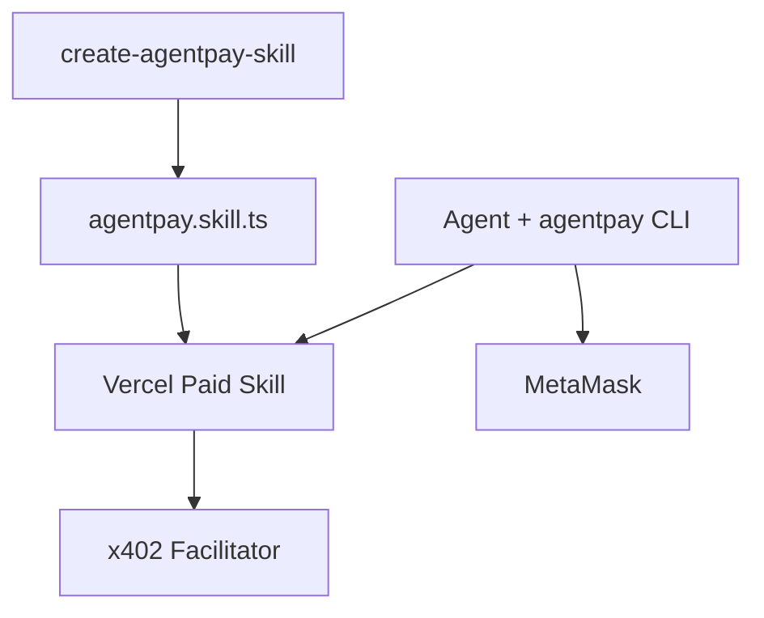
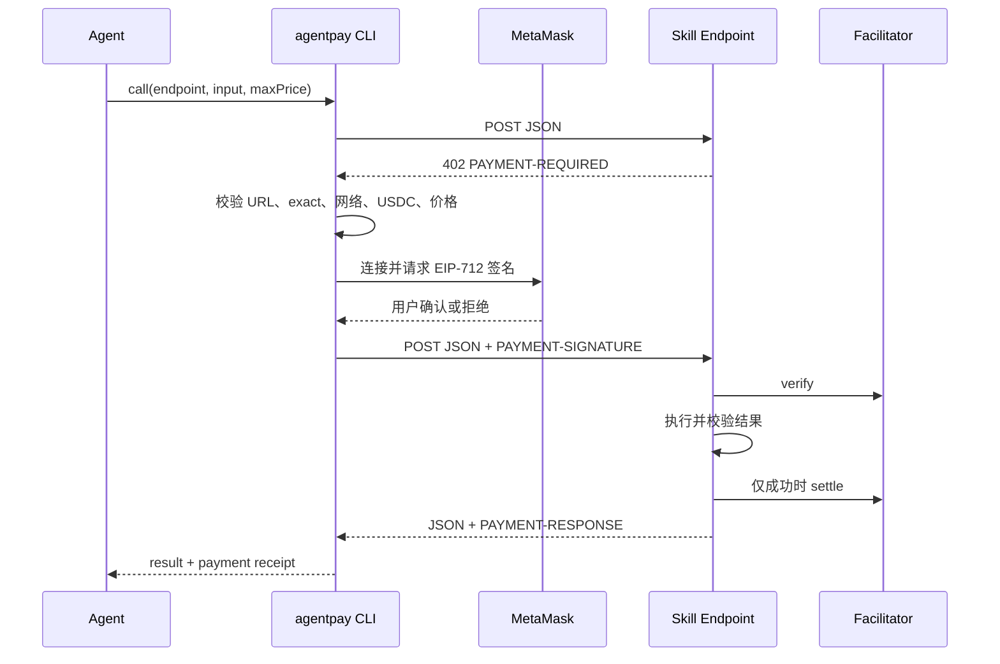

# AgentPayKit 同步付费 Skill MVP 设计

## 1. 文档状态

本设计取代仓库当前的“中央异步 Runtime + 本地 Browser Bridge + 自定义发行系统”MVP 架构，作为后续迁移和验收的唯一产品基线。

已确认的产品选择：

- MVP 只面向开发者，包括发布付费 Skill 的开发者和调用付费 Skill 的开发者；
- 发布过程压缩为“运行脚手架、维护一个 `agentpay.skill.ts`、执行一次部署”；
- AgentPayKit 提供官方 x402 的薄服务端封装，但不创建自定义支付协议；
- 一个付费 Endpoint 配置一个固定 USDC 单价；
- 每次调用都由使用者在 MetaMask 中明确确认；
- 只支持能够在 45 秒内完成的同步 Skill；
- Skill 执行成功且返回有效结果后才结算，失败、超时或结果无效时不收费；
- Skill 继续通过 GitHub 和原生 `SKILL.md` 发布，不创建私有安装包或 Registry；
- AgentPayKit 不托管资金、不代收款，MVP 不抽佣。

## 2. 第一性原理

付费 Skill 的最小闭环只有五个角色：

1. Agent 根据 `SKILL.md` 发起调用；
2. Skill Endpoint 声明本次调用的 x402 支付要求；
3. 使用者在 MetaMask 中确认并签署 USDC 支付授权；
4. Skill Endpoint 执行成功后通过 Facilitator 结算；
5. Agent 得到结果和支付回执。

AgentPayKit 补齐现有 Skill 生态缺少的两块：**让开发者不必理解 x402 内部细节就能发布标准付费 Endpoint，并让终端 Agent 能安全地使用 MetaMask 消费它。**

支付协议、钱包私钥管理、Skill 安装和 Skill 托管都已有成熟边界，不属于 AgentPayKit 自研范围。AgentPayKit 的服务端只组合官方 x402 SDK、输入输出校验和超时控制；底层验证、签名与结算仍由官方 SDK 和 Facilitator 完成。

## 3. 产品定义

AgentPayKit MVP 是一套小型 Node.js 开发者工具，只有三个对外产品包：

| 产品包                  | 使用者       | 职责                                                        |
| ----------------------- | ------------ | ----------------------------------------------------------- |
| `create-agentpay-skill` | Skill 发布者 | 生成可直接运行和部署的 Next.js 付费 Skill 项目              |
| `@agentpaykit/server`   | Skill 发布者 | 对官方 x402 SDK 做薄封装，并从一个配置生成付费 Route 与文档 |
| `@agentpaykit/cli`      | Skill 消费者 | 解析 x402、检查价格并通过 MetaMask 逐笔确认                 |



脚手架生成 Next.js Route、测试、`SKILL.md`、Vercel 配置和构建脚本。发布者只维护一个 `agentpay.skill.ts` 作为 AgentPayKit 配置源；业务实现可以直接写在该文件中，也可以导入已有模块。消费者只安装一次 `agentpay`，Codex 和 Claude Code 复用同一个 CLI 和同一个 MetaMask 连接。

### 3.1 AgentPayKit 负责

- 生成一个可安装、测试和部署的 Next.js 付费 Skill 项目；
- 校验单一 `agentpay.skill.ts` 中的名称、Endpoint、固定价格、网络、Payee、Schema 和超时；
- 将官方 x402 Next.js 适配器组合成固定的“输入校验 → 402 → 验证 → 执行 → 输出校验 → 成功结算”Route；
- 从同一配置生成普通 `SKILL.md`，避免价格、Endpoint 与调用上限手工漂移；
- 提供 Vercel 默认部署模板和发布前 Conformance Test；
- 发送首次 Skill 请求并解析标准 x402 v2 `402` Challenge；
- 校验 Endpoint、网络、USDC 合约、收款地址和价格上限；
- 在签名前输出人类可读的支付摘要；
- 通过 MetaMask Connect 请求一次 EIP-712 签名；
- 携带 `PAYMENT-SIGNATURE` 重试一次请求；
- 解析 Skill 结果与 `PAYMENT-RESPONSE` 回执；
- 对拒绝、失败、超时和未知结算态提供稳定的机器可读错误。

### 3.2 AgentPayKit 不负责

- 实现或复制 EIP-712、EIP-3009、x402 验证与结算协议；
- 保存私钥、助记词或 MetaMask Secret Recovery Phrase；
- 运行中央支付 Runtime、Queue、数据库或对象存储；
- 托管发布者的 Skill 代码、API Key 或模型服务；
- 安装 Skill、打包 `.apkg`、签署 Release 或维护 Skill Registry；
- 为普通用户提供无代码创建器、提示词托管或模型额度；
- 为 Express、Hono、Fastify、Python 等框架维护首版脚手架；
- 为执行失败的 Skill 提供异步恢复、轮询或断点续传；
- 在没有人类确认时自动支付。

## 4. MVP 范围

### 4.1 支持范围

| 维度           | MVP 规则                                                |
| -------------- | ------------------------------------------------------- |
| 请求           | `POST` + `application/json`                             |
| 执行           | 同步，服务端业务执行上限 45 秒                          |
| 签名后响应超时 | 60 秒，包含 Skill 执行与结算                            |
| 钱包确认等待   | 固定最多 5 分钟，不计入签名后响应超时                   |
| 输入大小       | 最大 32 KiB UTF-8 JSON                                  |
| 响应大小       | 最大 1 MiB JSON                                         |
| 支付协议       | x402 v2 `exact`                                         |
| 资产           | Base 官方 USDC，6 位小数                                |
| 网络           | Base Sepolia `eip155:84532`、Base Mainnet `eip155:8453` |
| 定价           | 每个 Endpoint 一个发布者自定义固定价格                  |
| 钱包           | MetaMask Connect EVM + MetaMask Mobile                  |
| 授权           | 每次调用独立请求 `eth_signTypedData_v4`                 |
| 结果           | 同一 HTTP 响应返回 JSON 结果和支付回执                  |
| Agent          | Codex、Claude Code 及任何能执行 CLI 的 Agent            |
| 发布模板       | Next.js Route Handler + Vercel                          |
| 发布配置       | 每个项目一个根目录 `agentpay.skill.ts`                  |

### 4.2 明确不做

- 超过 45 秒的长任务；
- Queue、轮询、`status`、`resume` 和恢复状态机；
- 动态价格、按 Token/耗时计费、`upto`、订阅和套餐；
- 多链和非 USDC 资产；
- 本地预算数据库、Receipt 历史库和 PayInsight；
- MetaMask Smart Account 自动支付；
- MetaMask Agent Wallet 作为必需依赖；
- Skill 商店、Bazaar 自动发布和平台抽佣；
- 无代码发布、托管式 Skill Builder 和多框架脚手架；
- 完整 exactly-once 或网络中断后的自动对账。

### 4.3 工具链和依赖

首版使用当前稳定版 Node.js 和 pnpm；其余直接依赖按下表锁定，禁止使用宽松范围掩盖干净环境缺失的直接依赖：

| 依赖                    | 版本       |
| ----------------------- | ---------- |
| Node.js                 | 当前稳定版 |
| pnpm                    | 当前稳定版 |
| TypeScript              | `5.9.3`    |
| x402 packages           | `2.19.0`   |
| `@metamask/connect-evm` | `2.1.1`    |
| viem                    | `2.55.2`   |
| Zod                     | `4.4.3`    |
| tsx                     | `4.23.1`   |
| Next.js 示例            | `16.2.10`  |
| React / React DOM 示例  | `19.2.7`   |
| Vercel CLI              | `56.3.2`   |

根目录和每个 Workspace 必须显式声明自己直接导入的依赖。验收必须从无 `node_modules` 的临时副本运行 `pnpm install --frozen-lockfile`，不能用已有的提升依赖证明构建可复现。

## 5. 定价规则

“固定价格”表示一次调用在执行前已经确定，不随输入、Token、耗时或输出变化。发布者可以修改后续调用的价格，但不能在同一次执行结束后补价。

规则如下：

1. 发布者通过 `agentpay.skill.ts` 配置十进制字符串，例如 `0.001`、`0.05`、`0.2`；
2. 合法金额必须大于零，最多 6 位小数，不经过 JavaScript 浮点数；
3. 服务端把十进制字符串安全转换为 USDC atomic amount；
4. 标准 x402 `402` Challenge 是本次调用的实际报价；
5. `SKILL.md` 中的价格是说明和建议支付上限，不是可信报价源；
6. 使用者必须给 `agentpay call` 传入 `--max-price`；
7. Challenge 金额超过上限时，CLI 在连接 MetaMask 之前失败；
8. 基础版、专业版等不同价格在 MVP 中使用不同 Endpoint。

价格、网络、Facilitator 和收款地址都来自同一个配置文件，不能来自请求 Body。Payee 是公开地址，不作为 Secret 保存：

```ts
export default definePaidSkill({
  price: "0.05",
  payTo: "0xYourReceivingAddress",
  network: "base-sepolia",
  facilitatorUrl: "https://x402.org/facilitator",
  exampleInput: { repository: "https://github.com/owner/repository" },
  // ...其余配置
});
```

`https://x402.org/facilitator` 只用于测试网。Base Mainnet 必须由发布者配置支持主网的生产 Facilitator。

示例：

```text
POST /api/summary       -> 0.01 USDC
POST /api/code-review   -> 0.05 USDC
POST /api/deep-review   -> 0.20 USDC
```

## 6. 发布者旅程

发布者不再手动安装 x402 包、编写支付中间件或维护 `SKILL.md`。目标旅程固定为三步：

```bash
# 1. 生成项目
pnpm create agentpay-skill@latest paid-repo-review

# 2. 只修改 AgentPayKit 配置和自己的业务实现
cd paid-repo-review
$EDITOR agentpay.skill.ts

# 3. 本地测试通过后，一次部署
pnpm deploy
```

`pnpm deploy` 使用脚手架内固定的 Vercel 部署脚本，先运行配置校验、Conformance Test 和生产构建，全部通过后只调用一次 Vercel Production Deployment；脚本随后捕获生产 URL、验证在线 `402` 报价，并在本地生成正式 `SKILL.md`。Vercel 登录、项目归属、域名可用性和发布者自己的上游 API Secret 属于部署平台或业务前置条件，不由 AgentPayKit 托管。

发布者的收款地址可以是自己的 MetaMask EVM 地址。发布者只配置地址，不在每次收款时操作钱包。Facilitator 负责验证消费者的支付授权并将 USDC 结算到该地址。

### 6.1 唯一配置文件

脚手架在项目根目录生成 `agentpay.skill.ts`。这是 AgentPayKit 发布信息的唯一真实来源：

```ts
import { definePaidSkill } from "@agentpaykit/server";
import { z } from "zod";
import { reviewRepository } from "./src/review-repository";

export default definePaidSkill({
  name: "paid-repo-review",
  description: "分析公开 GitHub 仓库并返回风险和改进建议",
  endpointPath: "/api/invoke",
  price: "0.05",
  network: "base-sepolia",
  payTo: "0xYourReceivingAddress",
  facilitatorUrl: "https://x402.org/facilitator",
  timeoutMs: 45_000,
  exampleInput: {
    repository: "https://github.com/owner/repository",
  },
  input: z.object({
    repository: z.string().url(),
  }),
  output: z.object({
    summary: z.string().min(1),
    signals: z.array(z.string()),
    recommendations: z.array(z.string()),
    sources: z.array(z.string().url()).min(1),
  }),
  execute: async (input, { signal }) =>
    reviewRepository(input.repository, signal),
  success: (result) => result.sources.length > 0,
});
```

该文件可以导入任意业务模块，因此“一个配置文件”只约束 AgentPayKit 的接入面，不强迫开发者把全部业务代码塞进一个文件。模型 Key、GitHub Token 等业务 Secret 继续通过 Vercel Environment Variables 提供，不写入配置、`SKILL.md` 或仓库。

配置规则：

- `endpointPath` 固定为 `/api/invoke`，开发者不需要在首次部署前猜测 Vercel URL；
- `price` 是大于零且最多 6 位小数的 USDC 字符串；
- `network` 只接受 `base-sepolia` 或 `base`，由 Server 映射为 CAIP-2 Network；
- Base Sepolia 缺省使用 `https://x402.org/facilitator`，也允许显式覆盖；Base Mainnet 必须明确配置生产 Facilitator；
- `timeoutMs` 范围为 `1_000..45_000`，默认 `45_000`；
- `exampleInput` 必须通过 `input` Schema 校验、可序列化为不超过 32 KiB 的 JSON，并同时用于在线报价探测与 `SKILL.md` 示例；
- `input` 在返回 `402` 前验证，`output` 和 `success` 在结算前验证；
- `pnpm dev` 使用 `http://localhost:3000` 生成本地测试文档；`pnpm deploy` 只调用一次 Vercel Production Deployment，捕获其最终 HTTPS URL 后在本地生成正式 `skill/SKILL.md`；
- 正式 `SKILL.md` 中的 Endpoint 是“Vercel 返回的生产 Origin + endpointPath”，部署脚本必须先验证该 URL 可访问且返回与配置一致的 `402`，再宣布发布成功。

### 6.2 薄服务端封装

`@agentpaykit/server` 只提供以下稳定接口：

```ts
definePaidSkill(config);
createNextPaidSkillRoute(skill);
renderSkillMarkdown(skill);
validatePaidSkillConfig(config);
```

脚手架生成的 `app/api/invoke/route.ts` 是固定胶水代码，开发者无需修改：

```ts
import { createNextPaidSkillRoute } from "@agentpaykit/server/next";
import skill from "../../../agentpay.skill";

export const { POST } = createNextPaidSkillRoute(skill);
```

内部使用 Next.js Route Handler 和官方 `@x402/next`：

- 外层先克隆并校验 JSON 输入，明显无效的输入在出现付款提示前返回 `400`；
- 内层 `withX402` 负责 Challenge、支付验证和成功响应后的结算；
- 业务 Handler 使用 45 秒 AbortSignal；
- Handler 只在结果 Schema 校验通过时返回 `2xx`；
- `withX402` 只在成功响应后结算；
- 失败路径不得捕获错误后伪装成 `200`。

该包不导出自定义 Challenge、Payment Payload、Signer、Verify 或 Settle 数据结构。其他框架的开发者仍可直接使用官方 `@x402/express`、`@x402/hono`、`@x402/fastify` 或对应语言 SDK，但不属于首版“单配置发布”承诺。

### 6.3 脚手架输出

生成项目的固定结构为：

```text
paid-repo-review/
├── agentpay.skill.ts                 # 唯一 AgentPayKit 配置源
├── app/api/invoke/route.ts           # 生成后无需修改
├── src/review-repository.ts          # 示例业务实现，可替换或拆分
├── skill/SKILL.md                    # 根据配置自动生成
├── test/skill.test.ts                # 输入、输出、失败零收费测试
├── scripts/generate-skill.ts         # 接受明确 Origin，生成本地或正式 SKILL.md
├── scripts/deploy.ts                 # 一次 Vercel 部署并固化正式 Endpoint
├── vercel.json                       # 默认一次部署目标
├── package.json
└── README.md
```

脚手架必须拒绝覆盖非空目录；生成结果必须能够在干净环境完成冻结安装、测试、类型检查和生产构建。`SKILL.md` 是生成物，开发者不得手工维护价格、Endpoint 或 `--max-price`。

### 6.4 失败不收费的信任边界

“失败不收费”是发布者服务端必须履行的结算契约，不是消费者 CLI 可以从 `402` Challenge 中密码学验证的属性。用户签署 x402 授权后，恶意或错误配置的服务端仍可能在没有有效结果时发起结算。

因此 MVP 采用以下边界：

- 仓库内的 Next.js 示例和自动化 Conformance Test 必须证明非 `2xx` 零结算；
- 发布指南只把通过同一 Conformance Test 的 Endpoint 称为 AgentPayKit-compatible Paid Skill；
- CLI 不声称能够判断业务结果质量，也不为未知第三方 Endpoint 背书；
- 没有 Registry 的首版由使用者根据 GitHub 源码、发布者和 Payee 自行建立信任；
- 如果未来需要无需信任的结果担保，应单独设计 Escrow/仲裁协议，不能在 MVP 文案中假装现有 x402 `exact` 已经解决。

## 7. 使用者旅程

### 7.1 一次性准备

```bash
npm install --global @agentpaykit/cli
agentpay doctor
```

使用者准备：

- MetaMask Mobile；
- Base Sepolia 或 Base Mainnet 上的 USDC。

CLI 默认内置 Base 官方公共 RPC：`https://sepolia.base.org` 和 `https://mainnet.base.org`，用于连接、网络检查与单次 USDC 余额读取，因此使用者不需要申请 Infura Key。公共 RPC 受限流，只适合 MVP 的交互式低频调用；若未来出现稳定的高频消费需求，再增加可选自定义 RPC 配置。

第一次调用时，MetaMask Connect 在终端显示二维码。用户扫码建立连接。后续 CLI 进程优先恢复 MetaMask Connect 的现有 Session，但每次支付仍重新触发一次签名确认。Session 恢复失败时可以重新扫码，不能退化为本地私钥。

### 7.2 Agent 发起调用

```bash
agentpay call https://repo-review.example.com/api/invoke \
  --input-json '{"repository":"https://github.com/janily/AgentPayKit"}' \
  --max-price 0.05
```

CLI 在 MetaMask 签名前输出：

```text
Paid Skill payment request
Endpoint: https://repo-review.example.com/api/invoke
Network: Base Sepolia
Asset: USDC
Amount: 0.05 USDC
Payee: 0x1234...abcd

Waiting for MetaMask confirmation...
```

“明确确认”的 MVP 定义是：**CLI 完整展示人类可读支付摘要，MetaMask 对实际 EIP-712 USDC 授权进行最终确认。** 不要求 MetaMask 自身界面重复显示 Skill 名称。

## 8. 支付数据流



CLI 对同一次 `call` 最多发送两次业务请求：一次无支付请求和一次已签名请求。任何失败都不能自动创建第二份支付授权。

## 9. CLI 设计

### 9.1 命令面

MVP 只保留：

```bash
agentpay call <https-endpoint> --input-json '<json>' --max-price <usdc>
agentpay doctor
agentpay wallet disconnect
```

可选通用参数：

```text
--json       输出稳定的机器可读 JSON
--timeout    签名后请求超时，只能设置 1..60 秒，默认 60 秒
```

MetaMask 连接和签名确认使用固定 5 分钟等待上限，不受 `--timeout` 影响。

消费者 CLI 不再提供 `create`、`install`、`uninstall`、`invoke`、`status`、`resume`、`spend`、`receipts`、`release`、`publisher` 和 `payinsight`。发布脚手架通过独立的标准 `pnpm create agentpay-skill` 入口提供，避免把发布者命令混入消费者 CLI。

### 9.2 内部模块

CLI 内部保持小而清晰的模块边界：

| 模块        | 职责                                                                              |
| ----------- | --------------------------------------------------------------------------------- |
| `amount`    | 十进制 USDC 与 atomic `bigint` 双向转换和上限比较                                 |
| `challenge` | 解码并严格校验 x402 Challenge，选择唯一受支持要求                                 |
| `metamask`  | 使用内置 Base 公共 RPC 创建/恢复 MetaMask Connect Session，提供 EIP-1193 Provider |
| `signer`    | 将 EIP-1193 Provider 适配为官方 x402 `ClientEvmSigner`                            |
| `call`      | 两次 HTTP 请求、超时、响应限制和状态分类                                          |
| `doctor`    | 环境、配置和版本预检，不发起支付                                                  |
| `output`    | 人类输出与稳定 JSON 输出，禁止泄露支付签名                                        |

这些模块属于 `@agentpaykit/cli`，MVP 不为它们创建额外 workspace package。

### 9.3 Challenge 校验

CLI 必须在请求 MetaMask 之前验证：

- x402 版本为 `2`；
- Resource URL 与实际请求 Endpoint 完全匹配；
- Scheme 为 `exact`；
- Network 只能是 `eip155:84532` 或 `eip155:8453`；
- Asset 必须等于该网络在官方 x402 SDK 中定义的 Base USDC；
- Amount 是大于零的 atomic 整数字符串；
- Amount 不超过 `--max-price`；
- Payee 是合法非零 EVM 地址；
- Challenge 中存在且只存在一个可接受的 Base USDC `exact` 要求。

HTTPS 是默认硬要求。只允许 `localhost`、`127.0.0.1` 和 `[::1]` 在开发测试中使用 HTTP。

### 9.4 MetaMask 适配

使用 `@metamask/connect-evm` 创建 EVM Client，并通过官方 EIP-1193 Provider 请求：

- 当前网络与账户；
- USDC `balanceOf` 只读调用；
- `eth_signTypedData_v4` 支付授权签名。

签名器复用官方 `@x402/evm` `ExactEvmScheme`，不生成自定义 Typed Data，不复制 EIP-3009 实现。

账户选择使用 MetaMask Connect 返回的当前选中账户或 `selectedAccount`，不得默认把历史授权账户列表的 `accounts[0]` 当成当前账户。

每次 `call` 都调用一次 `eth_signTypedData_v4`。连接 Session 可以恢复，支付签名不能缓存、复用或预签。

## 10. 错误与收费语义

| 场景                               | CLI 结果                                    | 收费语义                       |
| ---------------------------------- | ------------------------------------------- | ------------------------------ |
| 首次响应为 `2xx`                   | 返回 `ok: true`、原始结果和 `payment: null` | 免费结果，不收费               |
| 首次响应为其他非 `402` 状态        | `ENDPOINT_REQUEST_FAILED`                   | 不收费                         |
| Challenge 无效                     | `INVALID_PAYMENT_REQUIRED`                  | 不请求签名，不收费             |
| 价格超过上限                       | `PRICE_EXCEEDS_MAXIMUM`                     | 不请求签名，不收费             |
| 网络或资产不支持                   | `UNSUPPORTED_PAYMENT_REQUIREMENT`           | 不请求签名，不收费             |
| 余额不足                           | `INSUFFICIENT_USDC_BALANCE`                 | 不请求签名，不收费             |
| MetaMask 拒绝                      | `PAYMENT_REJECTED`                          | Skill 不执行，不收费           |
| Skill 返回 `4xx/5xx`               | `SKILL_EXECUTION_FAILED`                    | 官方服务端适配器不得结算       |
| Skill 超时或结果无效               | `SKILL_EXECUTION_FAILED`                    | 官方服务端适配器不得结算       |
| Facilitator 结算失败并返回明确失败 | `SETTLEMENT_FAILED`                         | 按回执报告未结算               |
| 成功响应超过 1 MiB                 | `RESULT_TOO_LARGE`                          | 有回执则报告已收费，否则为未知 |
| 已签名请求响应在途中丢失           | `PAYMENT_STATE_UNKNOWN`                     | 可能已收费，不自动重试         |
| 成功响应缺少合法回执               | `PAYMENT_STATE_UNKNOWN`                     | 不声称已收费或未收费           |
| 成功                               | `ok: true` + result + receipt               | 精确收取一次固定价格           |

`PAYMENT_STATE_UNKNOWN` 是 MVP 的诚实边界。CLI 必须明确提示用户不要直接重试；后续版本再评估基于 Payment Identifier 或链上 Authorization 状态的恢复机制。

## 11. 安全约束

- 私钥和助记词始终只存在于 MetaMask；
- CLI、Skill、Agent Prompt、日志和测试证据不得包含私钥或完整支付签名；
- `--max-price` 是必填参数，CLI 对被选中的实际 Challenge 不允许跳过上限校验；
- CLI 不接受由请求 Body 动态指定的收款地址或价格；
- Challenge 与请求 URL 必须绑定，禁止跨 Endpoint 复用；
- 每次签名前展示 Endpoint、网络、USDC 金额和 Payee；
- 服务端价格、网络和 Payee 只从已构建的 `agentpay.skill.ts` 读取，不能由请求参数或 Body 覆盖；
- 服务端只允许受约束的公共 GitHub URL，示例不得成为通用 SSRF 代理；
- 结构化日志只记录错误码、耗时、HTTP 状态和截断后的域名，不记录输入、结果、Challenge、签名或钱包余额；
- MetaMask Connect analytics 在 CLI 中显式关闭；
- Base Mainnet 首次发布必须先通过 Base Sepolia Gate。

## 12. 示例 Skill

仓库只保留一个端到端示例：`paid-repo-review`。

输入：

```json
{
  "repository": "https://github.com/owner/repository"
}
```

输出：

```json
{
  "summary": "...",
  "signals": [],
  "recommendations": [],
  "sources": ["https://github.com/owner/repository"]
}
```

示例只读取公开 GitHub 仓库元数据、语言、README 和近期活动，生成确定性的仓库概览；可选的发布者侧 `GITHUB_TOKEN` 只用于提高 API Rate Limit。Skill 使用者不提供 GitHub Token、模型 Key 或服务端凭据。

成功策略：

- `summary` 非空；
- 至少一个 `source`；
- 所有 Source URL 都属于 `github.com` 或 `api.github.com`；
- 45 秒内完成；
- 输出通过 Schema 校验。

GitHub 返回不存在、限流、上游失败，或结果未通过校验时，Endpoint 返回非 `2xx`，不得结算。

## 13. 目标仓库结构

```text
agentpaykit/
├── packages/
│   ├── cli/                         # 消费者 CLI 与 MetaMask 适配
│   ├── server/                      # 官方 x402 的薄服务端封装
│   ├── create-agentpay-skill/       # Next.js/Vercel 脚手架
│   └── tsconfig/                    # 共享 TypeScript 配置
├── examples/
│   └── paid-repo-review/            # 由同一脚手架生成的端到端示例
├── skills/
│   └── paid-repo-review/
│       └── SKILL.md                 # Codex/Claude Code 共用说明
├── tests/
│   ├── integration/                 # CLI 与模拟 x402 Server 闭环
│   ├── e2e/                         # opt-in Base Sepolia Gate
│   └── repository/                  # 依赖和遗留模块约束
├── docs/
│   ├── publisher-quickstart.md
│   ├── consumer-quickstart.md
│   └── architecture.md
├── package.json
├── pnpm-workspace.yaml
└── README.md
```

## 14. 当前仓库迁移边界

迁移开始前在当前提交创建 `legacy-async-mvp` Git Tag。Tag 和 Git 历史是旧实现的归档，不在新主线继续维护两套架构。

### 14.1 保留并重写

| 当前路径                            | 处理                                                                                  |
| ----------------------------------- | ------------------------------------------------------------------------------------- |
| `packages/cli`                      | 保留 package 身份，重写为 `call/doctor/wallet disconnect`                             |
| `packages/tsconfig`                 | 保留并修正可复现构建依赖                                                              |
| `packages/payment`                  | 不保留 package 身份；可复用官方 x402 Spike 经验重写为新的 `packages/server`           |
| `packages/publisher`                | 不保留旧发行能力；仅可复用安全的目录生成经验创建新的 `packages/create-agentpay-skill` |
| `README.md`                         | 重写为同步付费 Skill 产品说明                                                         |
| 根 `package.json`、workspace、Turbo | 收敛到新工作区和验证命令                                                              |
| `LICENSE`、上游 provenance          | 保留 MIT 许可和来源记录                                                               |

### 14.2 删除

| 当前路径/能力                        | 删除原因                                         |
| ------------------------------------ | ------------------------------------------------ |
| `apps/runtime`                       | 不再运行中央 Runtime                             |
| `packages/runtime`                   | 不再有异步状态机、Queue 和恢复服务               |
| `packages/protocol`                  | 不再有 Quote、Invocation、Release 自定义协议     |
| `packages/payment` package           | 由新的薄 `@agentpaykit/server` 取代              |
| `packages/client`                    | 请求和钱包逻辑直接属于 CLI                       |
| `packages/browser-bridge`            | 改用官方 MetaMask Connect                        |
| `packages/publisher` package         | 删除 Release、签名、归档和委托；由纯脚手架包取代 |
| `packages/installer`                 | Skill 使用 Agent 原生安装方式                    |
| `packages/observability`             | MVP 只保留 CLI/服务普通结构化日志                |
| `packages/testkit`                   | 替换为新同步闭环的局部测试 Fixtures              |
| `examples/paid-deep-research-lite`   | 替换为真实同步 `paid-repo-review` 示例           |
| D1、Queue、R2、Wrangler Runtime 配置 | 新架构不需要中央持久化                           |
| `.apkg`、Release、双 Agent 安装测试  | 不属于新产品边界                                 |
| 旧 M0-M7 实施与验收文档              | 由 Git Tag 保留，不继续作为当前文档              |

删除旧模块只能在新 CLI、Server、脚手架生成项目、示例服务端和同步集成测试全部通过后进行。

## 15. 测试策略

### 15.1 单元测试

- `definePaidSkill` 拒绝非法名称、非 HTTPS Endpoint、非固定价、零地址、不支持网络、主网测试 Facilitator 和越界超时；
- 输入 Schema 在 `402` 前执行，执行异常、超时、输出 Schema 失败和 `success=false` 都返回非 `2xx`；
- `renderSkillMarkdown` 从配置生成准确的 Endpoint、价格和 `--max-price`，生成结果中不出现 Secret；
- 脚手架拒绝非空目录和非法包名，固定输入产生确定性的完整文件树；
- 十进制 USDC 转换不使用浮点数，覆盖最小单位、6 位小数和非法格式；
- Challenge URL、Scheme、Network、Asset、Amount、Payee 和唯一候选校验；
- 超过 `--max-price` 时不创建 MetaMask Client；
- 余额不足、错误网络和账户不可用时不请求签名；
- MetaMask 拒绝映射为稳定错误且不泄露签名数据；
- 同一个 MetaMask Session 连续两次 `call` 产生两次独立签名请求；
- HTTP Body 大小、JSON 解析和超时边界。

### 15.2 集成测试

使用本地模拟 Facilitator 和 x402 Server 验证：

1. 从空目录运行脚手架后，只修改 `agentpay.skill.ts` 即可完成冻结安装、测试、类型检查和构建；
2. 生成的 `skill/SKILL.md` 与配置中的名称、Endpoint、价格和网络一致；
3. 无签名请求返回标准 `402`；
4. 合法签名请求只执行一次 Handler；
5. 成功返回一次结算和可解析回执；
6. Handler `4xx/5xx`、抛错、超时和无效结果均为零结算；
7. 钱包拒绝后第二次请求未发送；
8. 已签名请求网络中断返回 `PAYMENT_STATE_UNKNOWN` 且不自动重试；
9. 自定义 `0.001`、`0.05`、`0.2` 均正确进入 Challenge；
10. Linux、macOS、Windows 不再存在平台硬编码拒绝。

### 15.3 真实 Base Sepolia Gate

真实 Gate 为 opt-in，默认 CI 不签名、不广播：

- 使用独立低价值 MetaMask 测试账户；
- 部署 `paid-repo-review` Base Sepolia Endpoint；
- 运行一次成功调用并人工确认；
- 运行一次 MetaMask 拒绝；
- 运行一次业务失败；
- 对成功调用核对 `PAYMENT-RESPONSE`、交易哈希、USDC Transfer 和 Payee 增量；
- 对拒绝和业务失败核对无 USDC Transfer；
- 每个场景必须由操作者明确启用，脚本不能代替 MetaMask 自动签名。

### 15.4 受控 Base Mainnet Gate

Base Sepolia 全部通过后，以示例价 `0.01 USDC` 执行一次受控 Mainnet 成功调用。该金额只是验收配置，不是产品固定价格。操作者必须在 MetaMask 中人工核对网络、金额和 Payee，随后核对一次 USDC Transfer、Payee 增量和支付回执。任何自动签名、批量执行或重复尝试都不属于该 Gate。

## 16. MVP Definition of Done

只有以下条件全部满足，才称为新版 MVP：

- 干净环境可以使用当前稳定版 Node.js 和 pnpm 完成冻结安装、测试、类型检查和构建；
- 产品工作区只保留 CLI、Server、脚手架、共享 TypeScript 配置和一个示例 Skill；
- 从已有可调用的业务函数出发，发布者只运行脚手架、修改一个 `agentpay.skill.ts` 并执行一次 `pnpm deploy`，不手写 x402、Route 或 `SKILL.md`，且部署命令内部只创建一次 Vercel Production Deployment；
- 开发者不需要预先知道正式 Endpoint；部署脚本从 Vercel 输出中获取 HTTPS Origin，生成正式 `SKILL.md` 并验证其报价与配置一致；
- 在 Vercel 已登录且生产域名可用的前提下，上述 AgentPayKit 接入与发布步骤可在 10 分钟内完成；业务函数开发、上游 Secret 配置和 DNS 生效时间不计入；
- 脚手架生成项目可以在空目录执行冻结安装、测试、类型检查和生产构建，且不会覆盖已有文件；
- 修改配置后，生成的 `SKILL.md` 与 Endpoint、固定价格、网络和 `--max-price` 保持一致；
- 消费者一次安装 CLI 后，Codex 与 Claude Code 能使用同一份 `SKILL.md`；
- Challenge 超价、错误网络、错误资产时 MetaMask 不被唤起；
- 每次真实支付都触发一次独立 MetaMask 确认；
- MetaMask 拒绝、Skill 失败、超时和无效结果均不结算；
- 仓库示例和发布者 Conformance Test 明确证明上述零结算语义，文档不把它错误描述为客户端可强制的能力；
- 成功调用只结算一次，并立即返回结果和可解析支付回执；
- 已签名响应丢失时返回 `PAYMENT_STATE_UNKNOWN`，不会自动重复付款；
- Base Sepolia 真实成功、拒绝和失败三个场景证据完整；
- 受控 Base Mainnet 成功调用只结算一次 `0.01 USDC`，且人工核对的 Payee、交易和回执一致；
- 仓库中不存在私钥、助记词、完整 Payment Signature 或真实钱包秘密。

## 17. 后续版本触发条件

只有真实用户反馈出现对应需求时才增加：

- 长任务需求稳定出现：评估异步 Job API，而不是恢复旧 Runtime；
- 高频小额调用的确认负担明显：评估 MetaMask Smart Accounts 或 Agent Wallet；
- 发布者需要发现能力：接入 x402 Bazaar 元数据；
- 非开发者发布需求成立：单独设计托管式无代码 Skill Builder，不扩张当前脚手架；
- 用户需要支出历史：基于链上回执增加只读索引；
- 平台具备真实交易规模：再评估抽佣、Registry 和托管服务。

## 18. 官方依据

- [x402 Seller Quickstart](https://docs.x402.org/getting-started/quickstart-for-sellers)
- [x402 Buyer Quickstart](https://docs.x402.org/getting-started/quickstart-for-buyers)
- [MetaMask Connect Node.js Quickstart](https://docs.metamask.io/metamask-connect/evm/quickstart/nodejs/)
- [MetaMask Connect Sign Data](https://docs.metamask.io/metamask-connect/evm/guides/sign-data/)
- [MetaMask Agent Wallet](https://docs.metamask.io/agent-wallet/)
